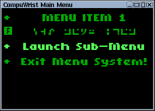

# CompuWrist Menu System
This project is to build a menu system for a Linux-based interface for a CompuWrist Computer.

## Current Progress
This is basically how the menus look so far (in TinyCore Linux - Debian will have a different title-bar):

## TODO
- [X] Make it use a form of exec for item action commands rather than the "system" command, that clearly isn't reliable (and has to wait for a response too).
- [ ] Some kind of digital clock?
- [ ] Decide whether to have the menu system wait for item action commands to complete or not.
- [ ] Deactivated Items.
- [ ] Get the Escape key working to close a Submenu.
- [X] Somehow match the background colours for X and Xft!  (At the moment, a grey background for instance results in boxes around the items).
- [ ] \(Optional) Somehow remove flickering when resizing the window?
